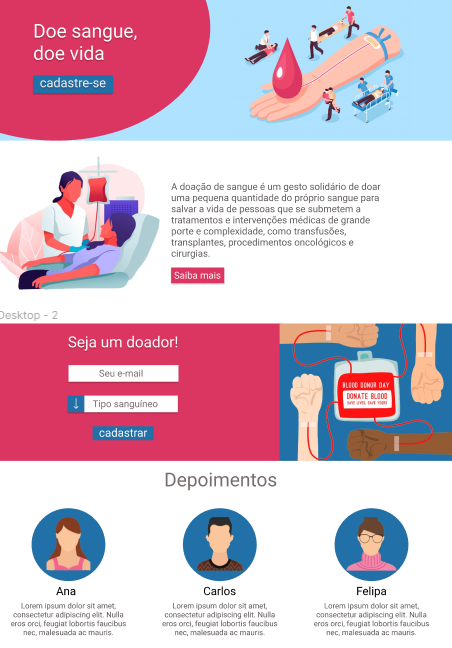

# <h3 align="center">UX PROJECT</h3>

   By Figma
     
     
    
     
     
       
 ## Build with
* [REACT]()
* [BOOTSWATCH]()

## Usage
UX project based in a high school project to students be interested in blood donation. Implemented in React using bootswatch.

## Architecture:
* Header
* Submit
* Donor experience

## Getting Started

git clone https://github.com/SthefanneBatista/crud-react/ ,
open file in terminal and yarn start to open in localhost

